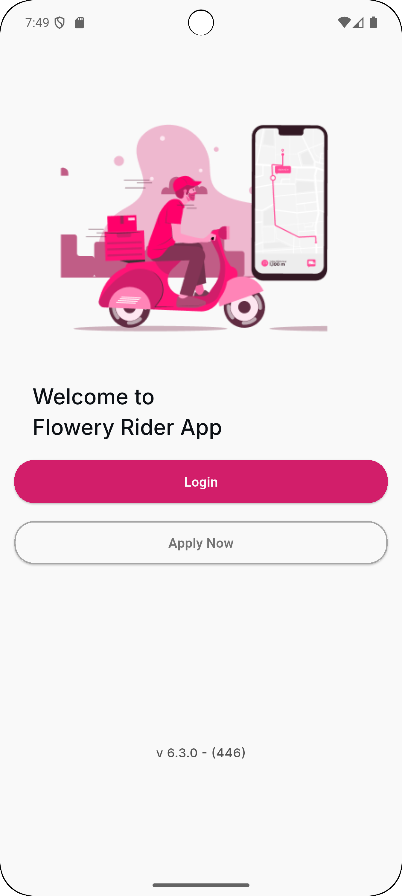
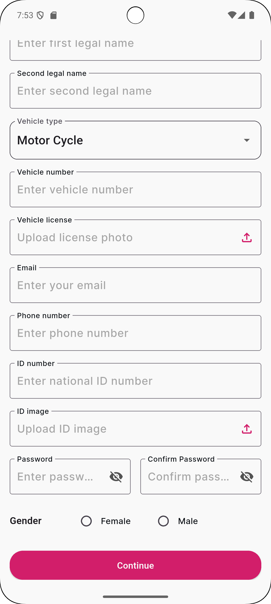
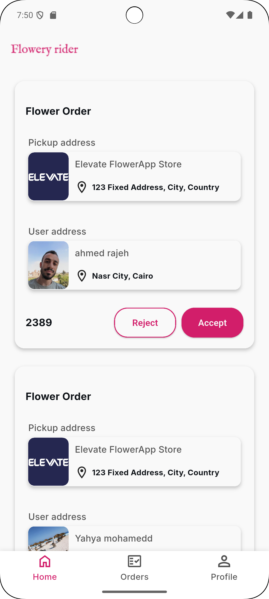
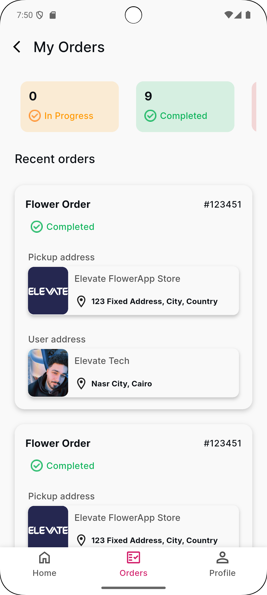
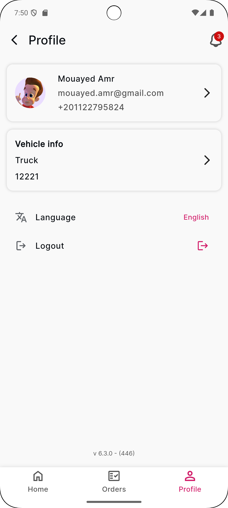
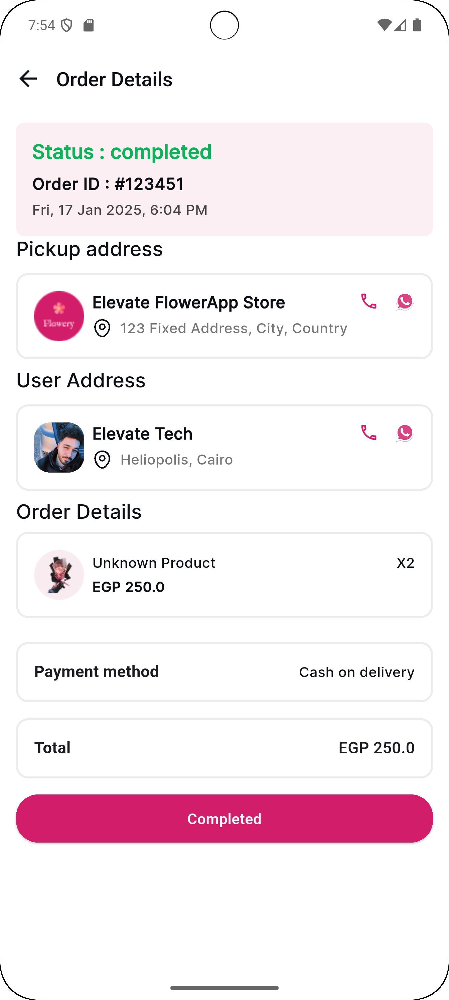
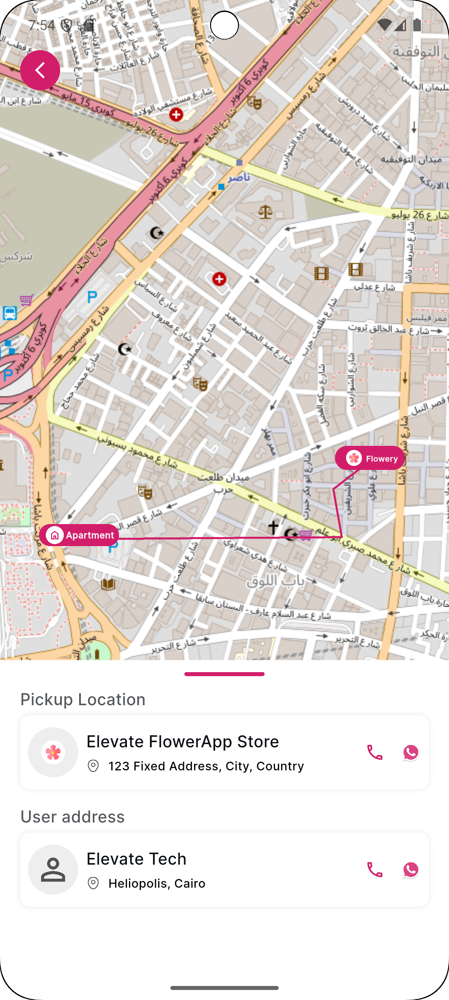
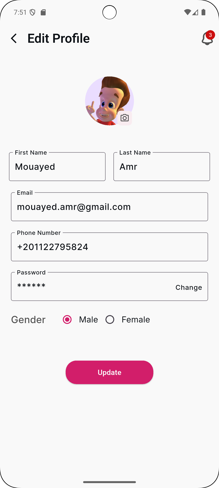

# 🛰️ Tracking App - Flower Delivery Tracking

A comprehensive Flutter application for tracking flower delivery orders with real-time location updates, modern UI/UX, and clean architecture implementation.

## Screenshots

### Onboarding & Authentication

| Onboarding Screen | Apply Screen | Localization |
|-------------------|--------------|--------------|
|  |  |  |

### Main Application

| Home Screen | Orders Screen | Profile Screen |
|-------------|---------------|----------------|
|  |  |  |

### Order Management

| Order Details | Order Map | Edit Profile |
|---------------|-----------|--------------|
|  |  |  |

## Project Structure

This Flutter app follows **Clean Architecture** principles with the following structure:

```
lib/
├── core/                           # Core functionality and shared components
│   ├── config/                     # Dependency injection and configuration
│   ├── constants/                  # App constants and themes
│   ├── errors/                     # Error handling
│   ├── extensions/                 # Dart extensions
│   ├── l10n/                       # Localization
│   ├── routes/                     # Navigation routes
│   └── widgets/                    # Reusable widgets
├── features/                       # Feature modules
│   ├── auth/                       # Authentication module
│   │   ├── api/                    # API clients and data sources
│   │   ├── data/                   # Data layer (models, repositories)
│   │   ├── domain/                 # Domain layer (entities, use cases)
│   │   └── presentation/           # Presentation layer (UI, view models)
│   ├── dashboard/                  # Main dashboard with navigation
│   ├── homescreen/                 # Home screen with order listings
│   ├── myorders/                   # My orders screen
│   ├── onboarding/                 # First-time user onboarding screens
│   ├── order_details/              # Order details and status view
│   ├── order_location/             # Real-time order tracking on map
│   ├── profile/                    # User profile management
│   ├── localization/               # Language and localization
│   └── logout/                     # Logout functionality
└── main.dart                       # App entry point
```

## Features

### 🔐 Authentication

- **Login/Logout**: Secure user authentication with Firebase
- **Apply**: Driver/rider application process
- **Password Recovery**: Forgot password functionality with email verification
- **Email Verification**: OTP-based email verification
- **Password Reset**: Secure password reset flow

### 🏠 Home & Navigation

- **Dashboard**: Main navigation hub with bottom navigation bar
- **Home Screen**: View available orders for pickup/delivery
- **My Orders**: View assigned orders and their status
- **Profile**: User profile and settings

### 📦 Order Management

- **Order Listings**: View available orders with status indicators
- **Order Details**: Complete order information including:
  - Order items and quantities
  - Customer information
  - Store/pickup location
  - Delivery address
  - Order status timeline
- **Order Status Updates**: Update order status through workflow:
  - Received your order
  - Preparing your order
  - Out for delivery
  - Delivered
- **Order History**: View past completed orders

### 🗺️ Real-time Order Tracking

- **Interactive Map View**: Real-time vehicle tracking on map
- **Route Visualization**: Display route from pickup to delivery location
- **Location Markers**: 
  - Current location
  - Pickup location
  - Delivery location
- **Map Controls**: Zoom, pan, and location tracking
- **Contact Integration**: Call or WhatsApp customer/driver

### 👤 User Profile

- **Profile Management**: Update personal information
- **Edit Profile**: Modify name, email, phone, and profile picture
- **Change Password**: Secure password change functionality
- **Settings**: App preferences and configuration
- **Localization**: Switch between English and Arabic

### 🌍 Internationalization

- **Multi-language Support**: English and Arabic
- **RTL Support**: Right-to-left text direction for Arabic
- **Localized Content**: Region-specific content and formatting
- **Dynamic Language Switching**: Change language on the fly

## 🛠️ Technical Stack

- **Framework**: Flutter 3.7.0+
- **State Management**: Flutter Bloc/Cubit
- **Architecture**: Clean Architecture (Data, Domain, Presentation layers)
- **Dependency Injection**: GetIt + Injectable
- **Networking**: Dio + Retrofit
- **Backend**: Firebase (Firestore, Auth, Storage, Messaging)
- **Real-time Updates**: Firestore Streams for order tracking
- **Local Storage**: Hive + SharedPreferences + Flutter Secure Storage
- **Maps**: Flutter Map + LatLng2
- **Location Services**: Location package for GPS tracking
- **Image Handling**: Image Picker + File Picker
- **UI Components**: 
  - Google Fonts (Inter font family)
  - Flutter SVG
  - Smooth Page Indicator
  - Step Progress Indicator
- **Testing**: Unit tests with Mockito and Bloc Test
- **Code Generation**: Build Runner

## 🧪 Testing

The app includes comprehensive test coverage:

- **Unit Tests**: 49+ test files in `test/features/`
- **Test Coverage**: Coverage reports available
- **Mocking**: Mockito for isolated testing
- **Bloc Testing**: Bloc Test for state management testing
- **Test Structure**: Clean Architecture pattern

## 🚀 Getting Started

### Prerequisites

- Flutter SDK 3.7.0 or higher
- Dart SDK
- Android Studio / VS Code
- Git
- Firebase account and project setup

### Installation

1. **Clone the repository**

   ```bash
   git clone <repository-url>
   cd tracking_app
   ```

2. **Install dependencies**

   ```bash
   flutter pub get
   ```

3. **Configure Firebase**

   - Add your `google-services.json` to `android/app/`
   - Configure Firebase for iOS if needed
   - Update `firebase_options.dart` with your Firebase configuration

4. **Generate code**

   ```bash
   flutter packages pub run build_runner build --delete-conflicting-outputs
   ```

5. **Run the app**

   ```bash
   flutter run
   ```

### Running Tests

```bash
# Run all tests
flutter test

# Run tests with coverage
flutter test --coverage
```

## 📦 Dependencies

### Core Dependencies

- `flutter_bloc` - State management
- `dio` - HTTP client
- `retrofit` - API client generation
- `injectable` - Dependency injection
- `get_it` - Service locator
- `dartz` - Functional programming utilities

### UI/UX

- `google_fonts` - Typography (Inter font family)
- `flutter_svg` - SVG image support
- `smooth_page_indicator` - Page indicators
- `step_progress_indicator` - Progress indicators
- `loading_indicator` - Loading animations
- `another_flushbar` - Toast notifications
- `fluttertoast` - Toast messages

### Storage & Data

- `hive` - Local database
- `hive_flutter` - Hive Flutter integration
- `shared_preferences` - Key-value storage
- `flutter_secure_storage` - Secure storage for sensitive data

### Maps & Location

- `location` - Location services
- `flutter_map` - Interactive maps
- `latlong2` - Latitude/longitude utilities

### Backend & Real-time

- `firebase_core` - Firebase integration
- `cloud_firestore` - Real-time database for order tracking
- `firebase_auth` - Authentication
- `firebase_storage` - File storage
- `firebase_messaging` - Push notifications

### Utilities

- `get` - Navigation and state management utilities
- `intl` - Internationalization
- `url_launcher` - Launch URLs and phone calls
- `image_picker` - Image selection
- `file_picker` - File selection
- `flutter_otp_text_field` - OTP input fields
- `country_flags` - Country flag display
- `logger` - Logging utility

### Development

- `mockito` - Mocking framework
- `bloc_test` - Bloc testing utilities
- `build_runner` - Code generation
- `json_serializable` - JSON serialization
- `retrofit_generator` - Retrofit code generation
- `injectable_generator` - Injectable code generation
- `hive_generator` - Hive code generation

## 📱 Platform Support

- ✅ Android
- ✅ iOS

## 🔒 Security

- Secure storage for sensitive data (tokens, credentials)
- Firebase Authentication for secure user management
- Encrypted local storage with Hive
- Secure password handling

## 📄 License

This project is private and proprietary.

## 👥 Contributing

This is a private project. For contributions, please contact the project maintainers.

